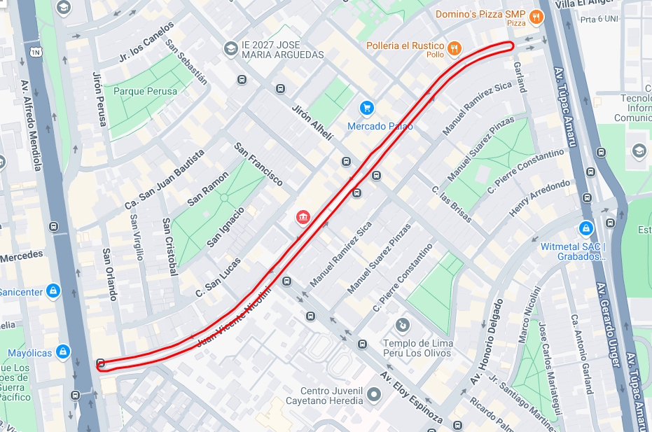

# GPS_TO_KML



**gps_to_kml** es un paquete de ROS2 en Python que provee herramientas para procesar archivos rosbag2 que contienen mensajes de tipo NavSatFix. Este paquete ofrece utilidades para:

- Leer e imprimir datos GPS desde un rosbag.
- Convertir coordenadas GPS a UTM y guardar los resultados en un archivo CSV.
- Convertir datos GPS a UTM y generar un archivo KML para visualización geográfica.

El paquete está diseñado siguiendo buenas prácticas de programación, con manejo robusto de errores y registro detallado (logging) para facilitar la depuración y el desarrollo.

## Tabla de Contenidos

- [Características](#características)
- [Instalación](#instalación)
- [Estructura del Paquete](#estructura-del-paquete)
- [Uso](#uso)
  - [Lectura del Rosbag](#lectura-del-rosbag)
  - [Conversión a UTM (CSV)](#conversión-a-utm-csv)
  - [Conversión a KML](#conversión-a-kml)
- [Visualización Ejemplo de KML](#visualización-ejemplo-de-kml)
- [Dependencias](#dependencias)
- [Licencia](#licencia)

## Características

- **Lector de Rosbag:** Lee mensajes NavSatFix desde un rosbag e imprime los datos GPS.
- **Conversor a UTM:** Convierte las coordenadas GPS a UTM y exporta los resultados a un archivo CSV.
- **Generador de KML:** Convierte los datos GPS a UTM y genera un archivo KML para su visualización en aplicaciones geográficas (por ejemplo, Google Earth).
- **Manejo de Errores y Logging:** Proporciona un registro detallado de la ejecución y manejo de errores para facilitar la depuración.

## Instalación

1. **Clonar el Repositorio:**

   ```bash
   cd ~/multipacha_ws/src
   git clone <url-del-repositorio> tu_package
   ```

2. **Instalar Dependencias:**

   ```bash
   sudo apt install ros-${ROS_DISTRO}-rosbag2-storage-mcap ros-${ROS_DISTRO}-rosbag2
   pip install pykml utm
   ```

3. **Compilar el Paquete:**

   ```bash
   cd ~/multipacha_ws
   colcon build --packages-select gps_to_kml
   source install/setup.bash
   ```

## Uso

### Lectura del Rosbag

```bash
ros2 run gps_to_kml read_rosbag <path_to_rosbag> --topic <gps_topic>
```

### Conversión a UTM (CSV)

```bash
ros2 run gps_to_kml gps_to_utm <path_to_rosbag> --topic <gps_topic> --output <output.csv>
```

### Conversión a KML

```bash
ros2 run gps_to_kml gps_to_kml <path_to_rosbag> --topic <gps_topic> --output <output.kml>
```

## Visualización Ejemplo de KML

1. Abre Google Earth
2. Selecciona "Abrir" y elige el archivo KML generado
3. Podrás visualizar la trayectoria GPS

## Dependencias

- ROS2 Jazzy (o versión compatible)
- Python 3.11+
- Paquetes ROS2:
  - rosbag2
- Paquetes Python:
  - pykml
  - utm

## Licencia

Este proyecto está licenciado bajo la Licencia MIT.
